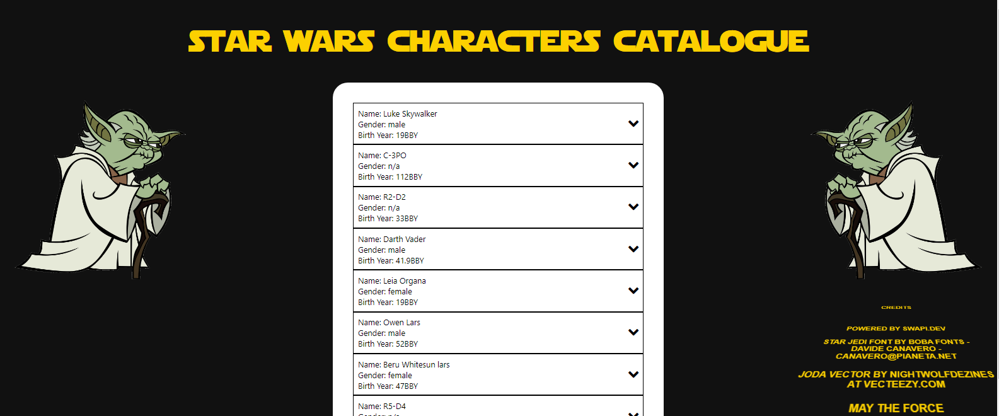
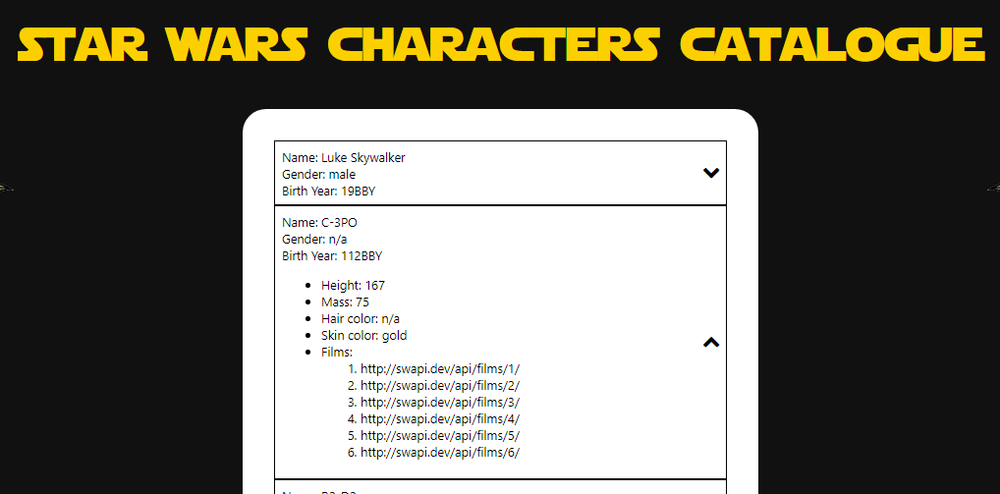
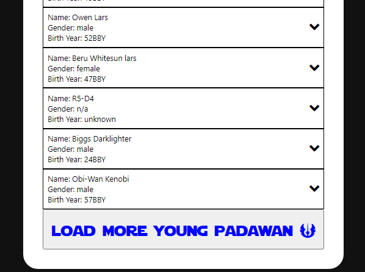

# Star Wars Characters Catalogue

## 1. LIVE DEMO: 

## 2. DESCRIPTION
Task description: Using `The Star Wars API` (https://swapi.dev/) create an interactive catalogue of star wars
characters. Data should be displayed on the screen in the form of a list, you should be
able to load more data as you wish and interact with existing elements.

## 3. INSTRUCTIONS HOW TO RUN LOCALLY

1. Run `git clone git@github.com:karolsz15/VL.git`
2. Go to project's directory with `cd ./VL`
3. Run `npm install` in your terminal in order to install all dependencies.
4. Run `npm start` in your terminal in order to start local server.
5. Browse `http://localhost:3000/` in your browser to see the App.

## 3. SCREENSHOTS:

#### 1. Homepage view
</img>

#### 2. Expanded tab presenting more details
</img>

#### 3. 'Load more' button
</img>
